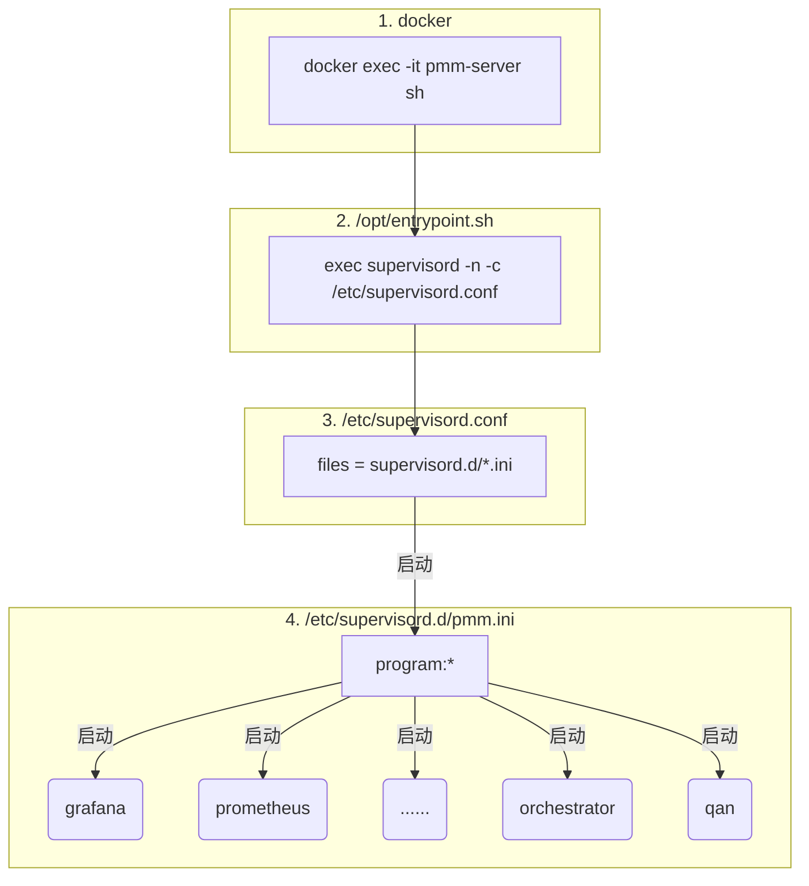
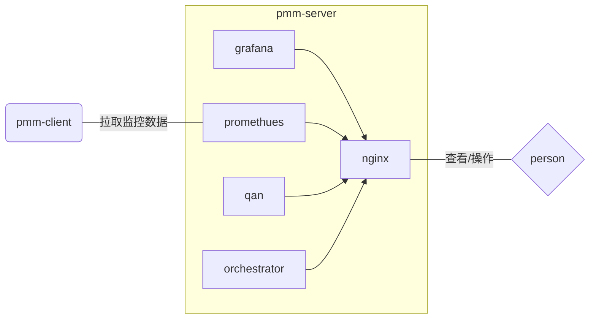
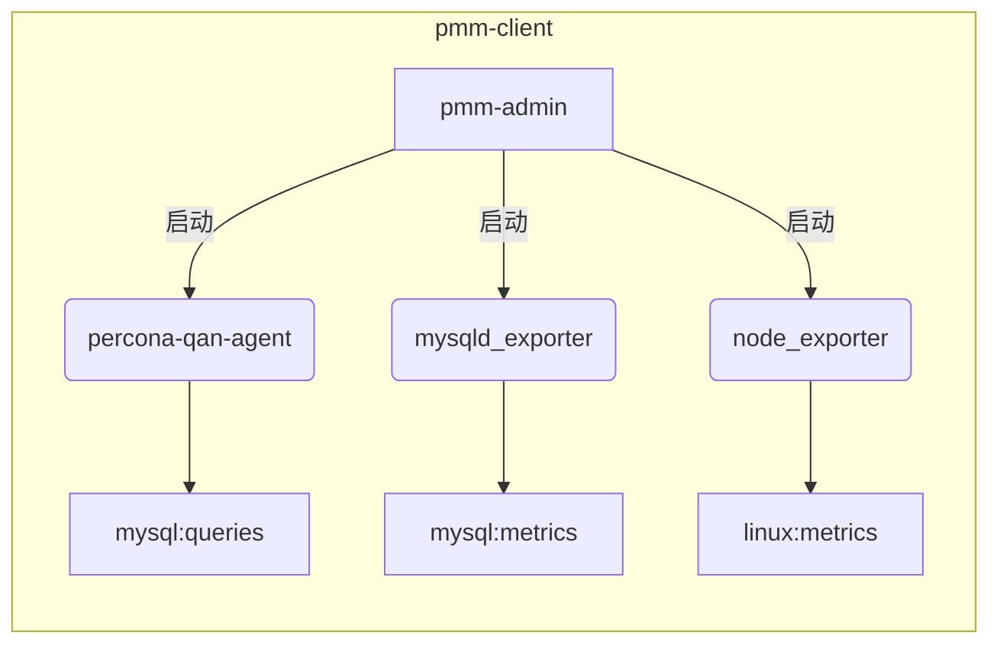

# PMM-mysql监控部署

## 一、PMM介绍 

​	Percona Monitoring and Management (PMM)是一款开源的用于管理和监控MySQL和MongoDB性能的开源平台，通过PMM客户端收集到的DB监控数据用第三方软件Grafana画图展示出来；也提供了Query Analytics的功能，可以检视执行了哪些SQL指令，并对执行效能较差的语法进行优化。

​	PMM针对操作系统的部份也提供了硬盘、网络、CPU和RAM的监控，特别的是它提供了Context switches、Processes和interrupts的监控，Context Switches可以看到CPU上下切换文的状况，Processes可以方便了解系统有多少程序在等待I/O。

## **二、PMM架构解析**

​	PMM架构如下图所示：


​	PMM client：搜集主机、数据库和查询分析数据等。

​	PMM Server：汇集监控数据并通过web页面展示。

​	PMM Server是作为Docker镜像distributed，而PMM Client就是一般的RPM，它需要安装Server端和Client端软件。

## **三、PMM-Server安装**

#### 3.1 docker安装

​	找一台相同操作系统（centos7）的机器，通过yum下载离线rpm包，然后离线安装，具体命令如下

```shell
#下载docker的yum源配置：https://download.docker.com/linux/centos/7/x86_64/stable/Packages/
yum-config-manager --add-repo https://download.docker.com/linux/centos/docker-ce.repo
#yumdownloader下载离线包，参数--resolve连同依赖包一起下载
yumdownloader --resolve  docker-ce

#打包上传到目标机器，解压后，通过以下命令安装
rpm -Uvh --force --nodeps *.rpm

#如果缺失依赖包，可通过以下命令查看已安装docker的依赖包，确认缺少什么包
yum deplist docker

#docker启动
service docker start #docker启动
service docker stop  #docker终止

#如果启动报错：Error starting daemon: SElinux is not supported with the overlay...
#在/etc/sysconfig/docker中 ，将selinux关闭，具体修改如下
#将OPTIONS=’–selinux-enabled –log-driver=journald –signature-verification=false’ 
#改为OPTIONS=’–selinux-enabled=false –log-driver=journald –signature-verification=false’
```

#### 3.2 pmm-server安装

  pmm-server是通过docker安装，以下为pmm-server安装过程命令：

```shell
#下载容器镜像
docker pull percona/pmm-server:latest
#将pmm-server镜像保存成tar归档文件
docker save -o pmm-server.tar docker.io/percona/pmm-server
#上传至目标机器，并导入docker
docker load -i pmm-server.tar

#建立数据卷容器
docker create -v /opt/prometheus/data -v /opt/consul-data -v /var/lib/mysql -v /var/lib/grafana --name pmm-data percona/pmm-server:latest /bin/true
#运行PMM Server,"-e ORCHESTRATOR_ENABLED=true"是mysql主从拓扑管理工具，具体功能待挖掘，详见https://www.jianshu.com/p/62e95a131028
docker run -d -p80:80 --volumes-from pmm-data -e ORCHESTRATOR_ENABLED=true --name pmm-server --restart always percona/pmm-server:latest

#查看pmm-server是否启动
docker ps -a |grep pmm
netstat -tnlp|grep 80

#进入容器，pmm-server是由docker run的--name参数命名的容器名，也可通过容器id进入容器
docker exec -it pmm-server sh

#通过浏览器打开pmm-server，验证是否所有页面打开正常，端口为80，既是展示端口，也是数据上报端口;grafana登录密码和账号：admin/admin
http://${pmm-server_ip}/graph  #打开grafana，监控页面
http://${pmm-server_ip}/prometheus  #打开prometheus，监控数据库
http://${pmm-server_ip}/orchestrator  #打开orchestrator，数据库复制的拓扑工具和图形界面
http://${pmm-server_ip}/qan  #分析mysql数据库的查询性能
```

#### 3.3 pmm-server启动

​	pmm-server启动调用链路示意图：



#### 3.4 pmm-server架构

​	pmm-server主要包含组件以及调用示意图如下：



  

## **四、PMM-Client安装**

#### 4.1 pmm-client启动

​	pmm-clinet启动调用链路简单示意图：



#### 4.2 pmm-client安装

​	客户端机器（mysql）安装pmm-client，通过rpm安装，到官网https://www.percona.com/downloads/pmm/1.8.0/binary/redhat/7/选择rpm包。

```shell
#下载rpm包
wget https://www.percona.com/downloads/pmm/1.8.0/binary/redhat/7/x86_64/pmm-client-1.17.1-1.el7.x86_64.rpm
#上传到目标机器，并安装
rpm -ivh pmm-client-1.17.1-1.el7.x86_64.rpm
#pmm-client安装成功，须有pmm-admin以及mysqld_exporter和node_exporter等组件
pmm-admin -v #查看pmm-admin的版本，确认client是否安装成功
cd /usr/local/percona/pmm-client; ls -l  #查看是否有mysqld_exporter和node_exporter等组件
```

#### 4.3 注册节点信息

​	客户端机器需要将自己的信息注册到服务端pmm-server，具体操作如下：

```shell
#配置服务端
pmm-admin config --server ${server-ip}
#查看服务端注册信息
pmm-admin config
#检查客户端和服务端信息
pmm-admin check-network
#注册客户端信息，pmm是mysql的用户和密码，需要提前创建；可通过${name}实现单机多实例上报。
#pmm-admin add mysql --user pmm --password pmm --host 172.16.16.16 --port 3306 mysql-16-3306
#pmm-admin add mysql --user pmm --password pmm --host 172.16.16.16 --port 3307 mysql-16-3307
pmm-admin add mysql --user pmm --password pmm --host ${client_ip} --port ${port}  ${name}
pmm-admin remove mysql  #注销客户端信息
#查看上报数据的组件状态
pmm-admin list
```

#### 4.4 自定义上报

​	node_exporter支持指定维度上报，具体可通过node_exporter --help查看collector.textfile.directory的说明；pmm-admin也支持exporter程序启动时带自己参数，具体可通过pmm-admin add linux:metrics --help查看exporter_args和Usage的说明；

```shell
#查看注册节点，以及查看node_exporter进程，注意，此时node_exporter 的参数collector.textfile.directory参数
pmm-admin list ; ps -ef|grep node_exporter
#SERVICE TYPE   NAME           LOCAL PORT  RUNNING  DATA SOURCE                     OPTIONS
#linux:metrics  VM_0_7_centos  42000       YES      - 

#删除node_exporter的节点进程
#pmm-admin remove ${SERVICE TYPE}   ${NAME} 
pmm-admin remove linux:metrics  VM_0_7_centos

#再次查看inux:metrics和node_exporter都没有了
pmm-admin list ; ps -ef|grep node_exporter

#添加node_exporter参数:-collectors.enabled=textfile启动文件上报功能,-collector.textfile.directory指上报文件存放目录/usr/local/percona/pmm-client/textfile-collector。
pmm-admin  add linux:metrics VM_0_7_centos -- -collector.textfile.directory=/usr/local/percona/pmm-client/textfile-collector  -collectors.enabled=textfile
#注意-collectors.enabled=textfile会覆盖默认的参数，导致系统监控数据没有上报，故要将默认的参数添加到启动命令里，如-collectors.enabled=textfile，diskstats,filefd,filesystem,loadavg,meminfo,netdev,netstat,stat,time,uname,vmstat,meminfo_numa,textfile

#查看node_exporter启动命令中是否带有参数
ps -ef|grep node_exporter |grep 'textfile' --col

#验证node_exporter数据上报
cd /usr/local/percona/pmm-client/textfile-collector
echo "my_test 12345" >> test.prom  #在node_exporter启动时指定目录下，创建任意.prom文件，可以是多个prom文件，以test.prom为例，写入维度数据就会同步到node_exporter以及被prometheus抓取。
curl 'http://10.20.0.2:9100/metrics'|grep my_test
或者浏览器打开http://172.17.0.2:9090/graph，然后查找my_test
```


## **五、Orchestrator**

#### 5.1 Orchestrator简介

​	Orchestrator是一款开源的MySQL复制拓扑管理工具，能够提供Web界面展示MySQL集群的拓扑关系及实例状态，支持MySQL主从复制拓扑关系的调整、支持MySQL主库故障自动切换、手动主从切换等功能

相比于MHA，Orchestrator更加偏重于复制拓扑关系的管理，能够实现MySQL任一复制拓扑关系的调整，并

#### 5.2 Orchestrator启动

​	Orchestrator生效需要在启动pmm-server容器的时候配置相关的参数，具体如下：

```shell
# -e ORCHESTRATOR_ENABLED=true 参数Orchestrator生效
docker run -d -p80:80 --volumes-from pmm-data -e ORCHESTRATOR_ENABLED=true --name pmm-server --restart always percona/pmm-server:latest
```

#### 5.3 Orchestrator配置

​	由于Orchestrator操作远程数据库，需要有效的数据库账号，故需相关的账号配置：

```shell
#进入pm-server容器
docker exec -it pmm-server sh
#修改远程数据库用户和密码，MySQLTopologyUser 和 MySQLTopologyPassword
vi /etc/orchestrator.conf.json
#确认上面修改的账号能否登陆远程数据库：
mysql -h ${mysql_ip} -P ${mysql_port} -u ${user} -p${password}

#如果页面还是没有显示拓扑图，通过日志定位错误。
tail /var/log/orchestrator.log -f
grep -i error /var/log/orchestrator.log  --col
```

#### 5.4 Orchestrator故障处理

​	Orchestrator配置/etc/orchestrator.conf.json中可以自定义故障时，配置故障处理脚本，各个阶段如何处理可以通过网上查看详细的资料。

```json
  "OnFailureDetectionProcesses": [
    "echo 'Detected {failureType} on {failureCluster}. Affected replicas: {countSlaves}' >> /tmp/recovery.log"
  ],
  "PreFailoverProcesses": [
    "echo 'Will recover from {failureType} on {failureCluster}' >> /tmp/recovery.log"
  ],
  "PostFailoverProcesses": [
    "echo '(for all types) Recovered from {failureType} on {failureCluster}. Failed: {failedHost}:{failedPort};
 Successor: {successorHost}:{successorPort}' >> /tmp/recovery.log"
  ],
  "PostUnsuccessfulFailoverProcesses": [],
  "PostMasterFailoverProcesses": [
    "echo 'Recovered from {failureType} on {failureCluster}. Failed: {failedHost}:{failedPort}; Promoted: {succ
essorHost}:{successorPort}' >> /tmp/recovery.log"
  ],
  "PostIntermediateMasterFailoverProcesses": [
    "echo 'Recovered from {failureType} on {failureCluster}. Failed: {failedHost}:{failedPort}; Successor: {suc
cessorHost}:{successorPort}' >> /tmp/recovery.log"
  ],
```


#### 5.5  注册数据库

​	Orchestrator没有自动发现客户端的能力，需要到页面注册相关的数据库机器，注册页面链接：http://${pmm-server_ip}/orchestrator/web/discover


#### 5.6 数据库复制拓扑图

​	Orchestrator能够根据已注册的数据库生成相应的复制关系拓扑图，可以通过拖拽来改变数据库的复制关系，也可通过设置来重启复制设置，或者将数据库设置成可读，具体链接：http://${pmm-server_ip}/orchestrator

​	

## 六、consul服务发现

可以通过浏览器打开查看，也可以通过curl打开查看，或者consul命令（consul最好到官网下载最新，不然会缺少部分参数）。

```shell
#服务注册，json内容可以参见curl http://${pmm-server_ip:port}/v1/catalog/node/ltcs-mysqlshare01 | python -m json.tool  #获取节点信息
curl -X PUT -d '{"Datacenter": "dc1", "Node": "test", "Address": "1.1.1.1", "Service": {"Service": "kim:test", "tags": ["test-tags", "test-tags-1"], "Port": 7777}}' http://127.0.0.1:8500/v1/catalog/register

#进入容器，使用consul命令查看节点和服务信息，Consul版本为v1.5.3
./consul catalog nodes  #查看节点
./consul catalog services  #查看服务

#进入容器，通过consul的DNS API，使用dig获取服务的对应ip或者节点ip：
#linux:metrics为"./consul catalog services"中的内容，获取相依ip列表
dig @127.0.0.1 -p 8600 linux:metrics.service.consul 
#ltcs-mysqlshare01为"./consul catalog nodes"中的第一列，一般为主机名称，通过这个命令可以获取相应的ip
dig @127.0.0.1 -p 8600 ltcs-mysqlshare01.node.consul  

#进入容器，通过consul的HTTP API，使用curl获取相关节点和服务信息，由于返回是json格式，可以通过json_reformat来显示，json_reformat需要安装，或者使用python -m json.tool
curl http://localhost:8500/v1/catalog/service/linux:metrics | json_reformat
curl http://localhost:8500/v1/catalog/node/ltcs-mysqlshare01 | python -m json.tool

#由于容器通过nginx做了反向代理，对外映射如下，故容器外面访问需通过容器主机的映射来访问:
## Consul API
#		location /v1/ {
#			proxy_pass		http://127.0.0.1:8500/v1/;}
curl http://${pmm-server_ip:port}/v1/catalog/nodes | json_reformat  #获取所有节点信息
curl http://${pmm-server_ip:port}/v1/catalog/node/ltcs-mysqlshare01 | json_reformat  #获取节点信息
curl http://${pmm-server_ip:port}/v1/services | json_reformat #获取所有服务信息
curl http://${pmm-server_ip:port}/v1/catalog/service/linux:metrics | json_reformat #获取服务信息
```


## 七、prometheus

- 进入容器，通过curl获取服务发现的consul的注册信息，命令如下：

```shell
curl http://localhost:8500/v1/catalog/services|python -m json.tool
```


- prometheus通过动态替换的方式配置

```json
job_name: linux   #监控linux资源信息
  scrape_interval: 1s   #抓取时间为1s
  scrape_timeout: 1s   #抓取超时为1s
  metrics_path: /metrics  #抓取维度路径
  scheme: http  #抓取方式，通过http的访问方式获取
  static_configs:  #静态配置，主要是pmm-server本机维度监控配置
  - targets:  #目标信息
    - localhost:9100   #目标机器端口9100
    labels:   #标签
      instance: pmm-server  #目标机器标识
  consul_sd_configs:   #consul自动服务发现,动态配置
  - server: localhost:8500  #consul服务发现的访问ip和port
    datacenter: dc1    #数据中心
    tag_separator: ','  #隔离标识
    scheme: http   #http的访问方式
    services:   #服务维度是linux:metrics，参见前面命令截图
    - linux:metrics
  basic_auth:  #基础鉴权，此次应该没用到，保留意见
    username: pmm
    password: pmm
  tls_config:   #不知道什么鬼，忽略
    insecure_skip_verify: true
  relabel_configs:   #可替换配置
  - source_labels: [__meta_consul_tags]  #数据源标识：consul下的linux:metrics内的数据组
    separator: ;   #不清楚作用，保留意见
    regex: .*,alias_([-\w:\.]+),.*  #正则表达式，获取到ip组
    target_label: instance #目标标识，实例
    replacement: $1  #替换前面一个参数
    action: replace  #动作替换
  - source_labels: [__meta_consul_tags]
    separator: ;
    regex: .*,scheme_([\w]+),.*
    target_label: __scheme__
    replacement: $1
    action: replace
```


## 八、grafana

​	Grafana是一个开源的度量分析与可视化套件，支持多样的数据源，以及丰富图形插件。grafana还提供丰富的监控展板模板，通过导入模板，可以快速地实现美观的监控界面；再者，grafana还支持告警，当监控的数据超过告警阈值时候，监控页面会有相关的告警提醒，也支持自定义外部告警通道，如邮件、钉钉、微信等。


## 九、附录